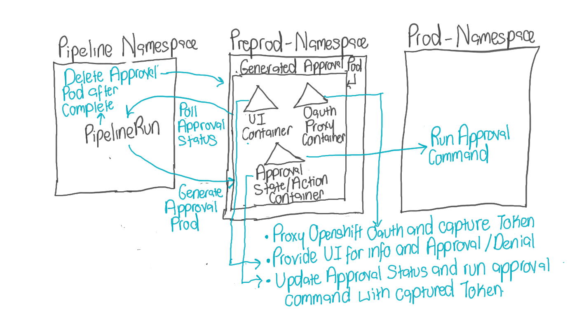
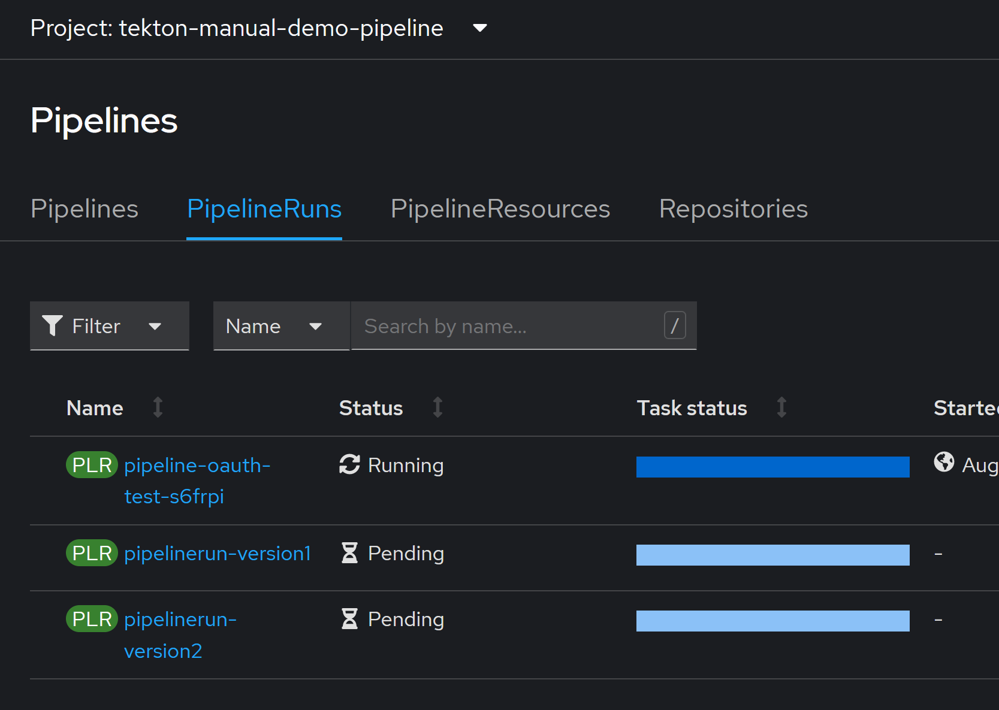
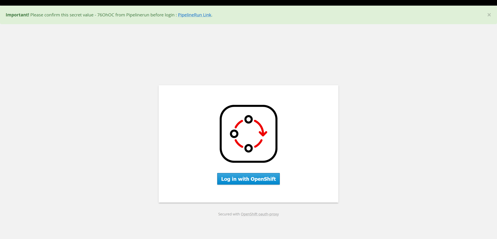
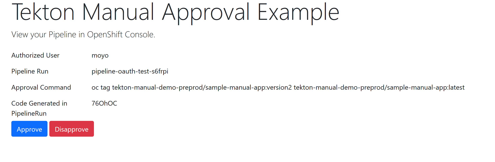

# manual-tekton-approval-task
An example Manual Approval Task for Tekton on OpenShift using OpenShift Oauth Proxy. 

As of this writing Tekton does not provide a Tekton task to provide manual approvals.
There are excellent examples that can be used to also deliver a similar functionality, please see [automatiko](https://github.com/automatiko-io/automatiko-approval-task).
This repo provides an example of a Tekton task that can also be used to deliver a manual approval functionality in Tekton.


## How does it work


- The task will generate an approval pod that contains 3 containers
  - A UI Container: Will Provide a visual option for approval/denial action to user and capture the oauth token provided by OCP.  
  - An Oauth-Proxy Container: This will proxy the users OpenShift authentication and provide the oauth token to the UI container.  
  - The Approval State/Action Container: This will check approval status and run the approval command using the captured openshift token.
- The UI app will be exposed at an OpenShift Route with a unique key to help confirm which pipelinerun generated it.
- The user will be able to log in with their credentials at that route provide an approval and denial and see the command that will be run as part of that approval.
- The approval action container will get the token run the approval command and communicate the approval status to the pipelinerun.
- The pipelinerun will cleanup the approval pod and continue with the remaining pipeline steps and store the approval response in a result.

## Design Choices
- The generated approval pod was choosen to be deployed in a seperate namespace from the pipeline and with a temporary pod to reduce(hopefully eliminate) the exposure of the oauth token.
- The approval command is also run in the same temporary generated approval pod to reduce the exposeure of the oauth token.So the oauth token never leaves the temporary pod.
- The pipelinerun will generate random strings for the approval, denied and to 6 digit code to help identify each time the pipeline is run and prevent a replay attack.
- Using a seperate namespace help RBAC division since the person running the pipeline need not have access on the namespace the approval pod is built in.Please note though the example provided uses a more extensive RBAC role because it has to build the proxy and pod images.
- The proxy image has been customized to show the unique approval code on the proxy login page before a user has to login. This should provide some confidence that the appropriate app is requesting it.
- The app will also show the approval user which approval command will be run before providing approval.
- The UI app should make sure approval/denial is only provided once.
- [OpenShift Oauth Proxy](https://github.com/openshift/oauth-proxy) provides a sar feature which can use to control which set of users can provide the approval.
- The approval app would require it claims a role which determines what access the token used to run the approval command will have.In the [example task provided](./manual-tekton-approval-task/deploy/pipeline/task-oauth-approval.yaml) we use the admin role for the namespace the pod is deployed in. In practise you would want to create a custom role for your specific use case.


## Run the example
- Clone this repo
- Run
    ```
    oc apply -k ./manual-tekton-approval-task/deploy/
    ```
- This should create the necessary manifests for the example. In our example we have 2 pipelineruns that update an image in our preprod namespace with version1/version2 of our image.Our application in the prod namespace will pull the latest version of our image based on the last completed run.
- Rerun any of the pending pipelineruns in tekton-manual-demo-pipeline namespace. It should start a new pipeline.

- This is going to take quite a while to get ready. To make this example self-contained it also build's it's required images.Review pipeline logs to see whats happening.
- When ready the pipeline logs should provide the link where you can provide approval.
 
- Accessing that Link from the logs above should send you to the proxy login URL.
 
- Click the login with OpenShift and enter your OpenShift credentials. This should take you to the UI app.

- Once approved the pipeline should delete the temporary approval pod and it's requirements.
